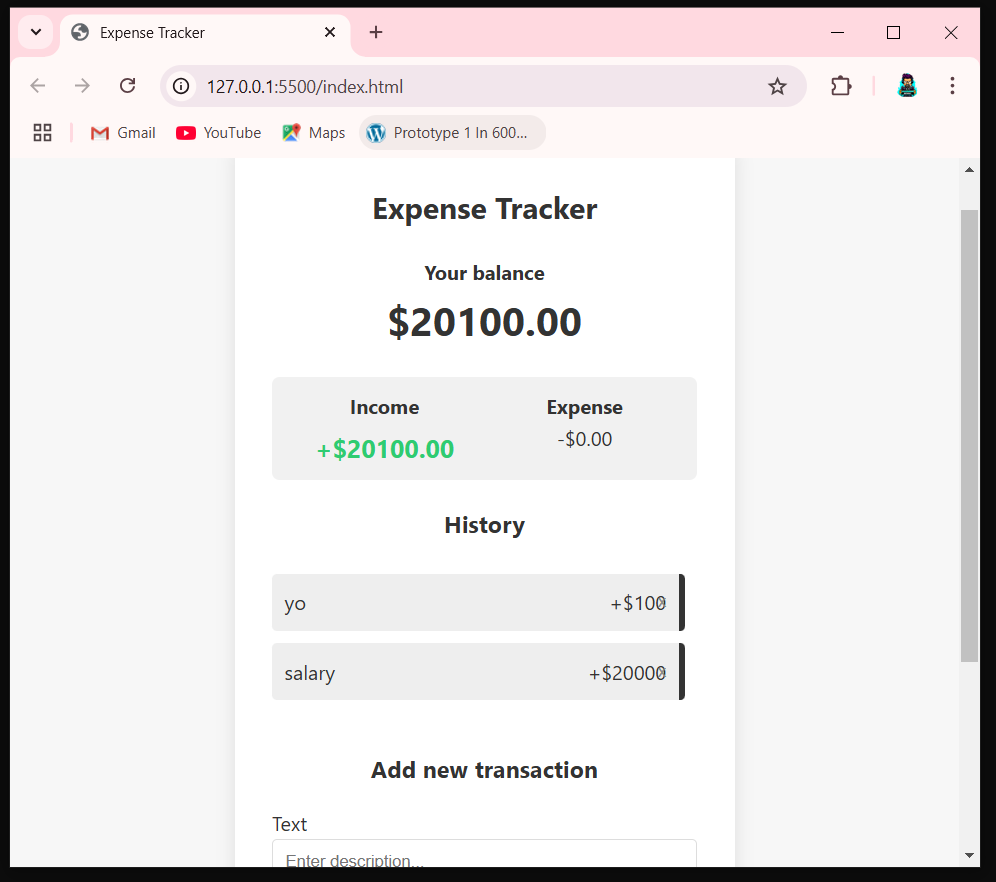

# 💸 Expense Tracker App

A simple and stylish expense tracker web app built with HTML, CSS, and JavaScript. It helps you track your income and expenses with an intuitive interface and stores data using `localStorage` so you never lose your entries on refresh!

## 🚀 Features

- ✅ Add income and expense entries
- ✅ View current balance
- ✅ Automatically calculate total income and expenses
- ✅ Delete transactions
- ✅ Data persists using browser `localStorage`

## 📸 Screenshot

## 🛠️ Tech Stack

- HTML5
- CSS3
- JavaScript (Vanilla)
- localStorage API

## 📂 How to Use

1. Clone or download the repository.
2. Open `index.html` in your browser.
3. Add transactions by entering a **description** and **amount**:
   - Positive = Income
   - Negative = Expense
4. Delete a transaction using the **`x`** button next to each entry.

## 🙌 Author

**Shashank (shanki1001)**  
📌 [GitHub Profile](https://github.com/shanki1001)

---
