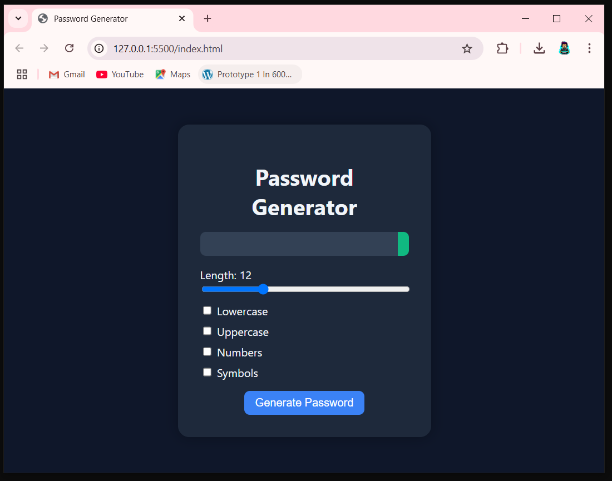

# 🔐 Password Generator

A simple and responsive password generator built using HTML, CSS, and JavaScript. You can customize password length and choose which character types to include.

## 🚀 Features

- Choose password length (4 to 32 characters)
- Include:
  - ✅ Lowercase letters
  - ✅ Uppercase letters
  - ✅ Numbers
  - ✅ Symbols
- Copy password to clipboard with one click
- Clean, responsive design

## 📸 Screenshot

## 🛠️ Built With

- HTML5
- CSS3
- JavaScript (Vanilla)

## 📁 How to Use

1. Clone this repository or copy the project files.
2. Open `index.html` in your browser.
3. Customize settings and click **Generate Password**.
4. Click the copy button to copy it to clipboard.

## 🧠 Learnings

- DOM manipulation
- Clipboard API
- Event handling
- Input validation and dynamic UI

## 📬 Feedback

Feel free to fork this repo, improve it, and open a pull request. Feedback and suggestions are welcome!

---

Now you can also take a screenshot of the final UI and name it `screenshot.PNG` to display properly in the README.

Once done, let me know and I’ll help you upload everything to your GitHub repo `JavaScript_Projects_All`!
