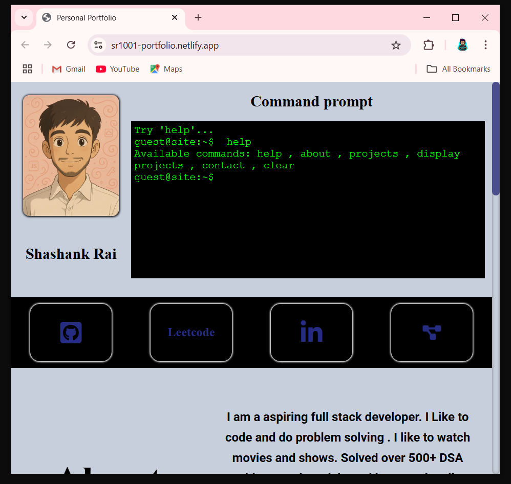

Created a mini-frontend project [ A portfolio website ] and deployed it on netlify. Showcasing my CSS and JavaScript skills in it. I have mentioned my numerous CLI projects written in C++ and node.js also other front-end projects.

I have not uploaded the fontawesome folder for the icons , in the project folder.

### Project Key points:-
1.Responsive in nature.
2. Simulated a terminal command prompt , which is interactive and receive several commands.
3. hashtag#About section
4. hashtag#Project Section having a flip card showcasing my different highlighted web projects.
5. hashtag#Contact section having social media links.

Project Link :- https://lnkd.in/gW3pkD4T

#Demo :- 

