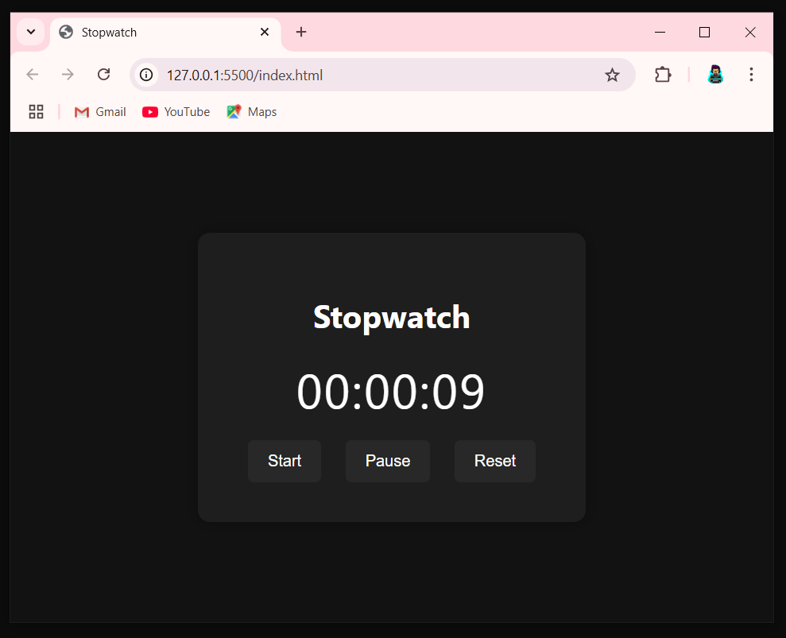

# ⏱️ Stopwatch / Digital Clock

A simple and clean web-based stopwatch built using HTML, CSS, and JavaScript.  
The app allows you to start, pause, and reset a digital timer with ease.

---

## 📸 Preview

---

## 🚀 Features

- Start, Pause, and Reset functionality
- Elegant dark theme UI
- Responsive and user-friendly interface
- Displays hours, minutes, and seconds in `hh:mm:ss` format

---

## 📂 Files Included

- `index.html` — Structure of the app
- `style.css` — Styling for the layout and design
- `script.js` — JavaScript logic for stopwatch functionality
- `screenshot.PNG` — UI screenshot for preview

---

## 🛠️ How to Use

1. Clone or download the project.
2. Open `index.html` in any modern web browser.
3. Use the buttons to start, pause, or reset the stopwatch.

---

## 📌 Future Improvements (Optional)

- Add lap functionality
- Add sound notifications
- Display live digital clock alongside stopwatch

---

## 🧑‍💻 Author

**Shanki1001**

---

Feel free to contribute or fork this project!