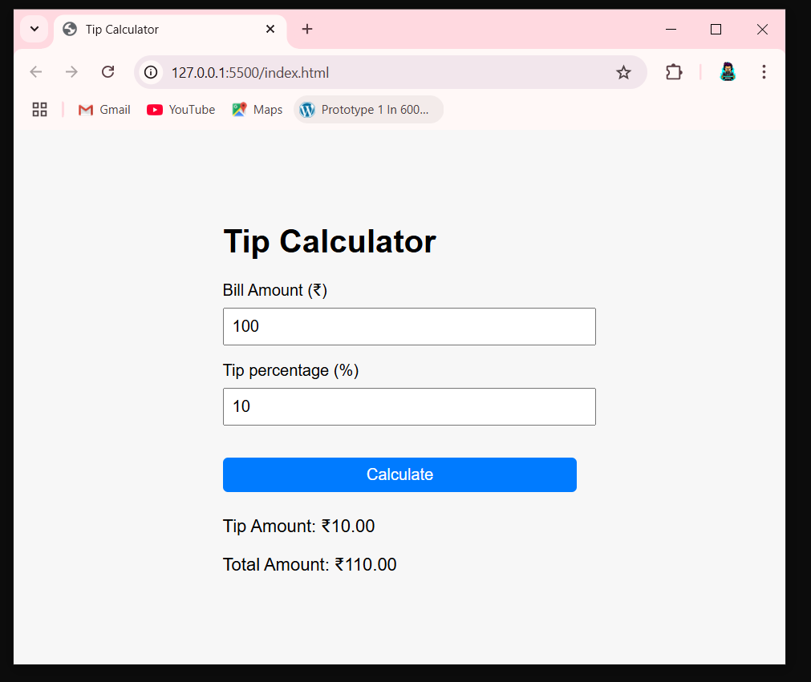

# Tip Calculator 🧮

A simple JavaScript project that calculates tip and total amount based on user input.

## Features
- Input bill amount and tip percentage
- Instant tip and total calculation
- Responsive design with clean UI

## How to Use
1. Enter the bill amount (₹)
2. Enter the tip percentage
3. Click "Calculate" to see the result

## Demo

