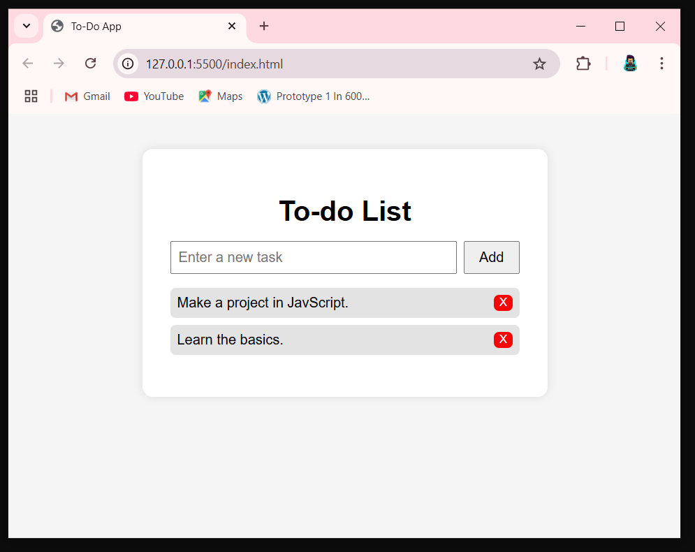

# 📝 To-Do App (with LocalStorage)

A simple and elegant To-Do application built using **HTML**, **CSS**, and **JavaScript**.  
This app allows users to add, delete, and persist tasks in the browser using the `localStorage` API — so your tasks are saved even after closing the browser!

---

## 🚀 Features

- ✅ Add new tasks
- 🗑️ Delete individual tasks
- 💾 Saves tasks in browser's localStorage
- ♻️ Tasks persist even after page reloads
- 🎯 Clean, responsive UI

---

## 📸 Demo Screenshot 

