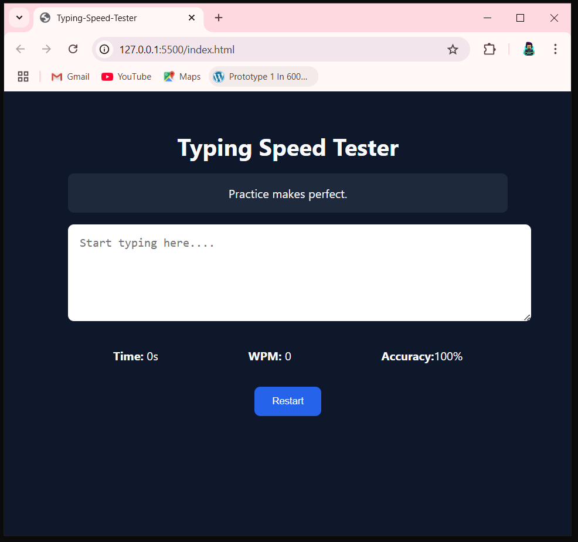

# ⌨️ Typing Speed Tester

A simple, responsive **Typing Speed Tester** built using **HTML**, **CSS**, and **JavaScript**. Test how fast and accurately you type with real-time stats and feedback!

---

## 🚀 Features

- ✅ Random quote display
- ✅ Real-time typing accuracy
- ✅ Words per Minute (WPM) calculation
- ✅ Timer to track performance
- ✅ Restart button to try again
- ✅ Fully responsive design

---

## 📸 Screenshot

---

## 🧠 How It Works

1. A random quote is shown at the top.
2. Start typing in the input box.
3. The app calculates:
   - **Time Elapsed**
   - **WPM** (Words Per Minute)
   - **Accuracy %** based on character comparison
4. You can restart anytime to try a new quote.

---

## 🛠️ Tech Stack

- **HTML**
- **CSS**
- **JavaScript (Vanilla)**

---

## 📁 Folder Structure

